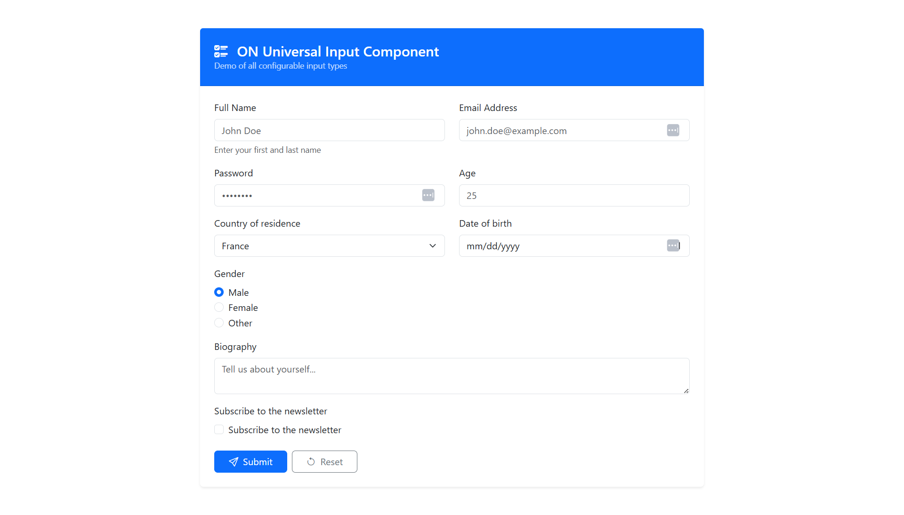

<div align="center">

</div>

# ON Universal Input Component

A small, reusable Angular input component that supports many input types (text, password, email, number, select, textarea, checkbox, radio, date) and implements ControlValueAccessor so it works with reactive forms and template-driven forms.

## Demo

See the component screenshot above. To include the exact image shown here, copy the attached screenshot into your project at `docs/screenshot.png` (create the `docs/` folder if it doesn't exist), or update the path below to point to your preferred image location.

## How to import the input into a new Angular project

There are two simple ways to use `DynamicInput` in a new project: copy the component files into your project, or import it from a library if you package this repo as one.

- Option A — Copy files
  1.  Copy the component files from this repository: [src/app/shared/components/dynamic-input/dynamic-input.ts](src/app/shared/components/dynamic-input/dynamic-input.ts), [src/app/shared/components/dynamic-input/dynamic-input.html](src/app/shared/components/dynamic-input/dynamic-input.html) and [src/app/shared/components/dynamic-input/dynamic-input.scss](src/app/shared/components/dynamic-input/dynamic-input.scss) into the same relative path in your project (for example `src/app/shared/components/dynamic-input/`).
  2.  Ensure your module imports `CommonModule` and `ReactiveFormsModule` (or `FormsModule` for template-driven usage).
  3.  Declare and export the component from a shared module so it can be used across your app.

  Example `SharedModule`:

  ```ts
  import { NgModule } from "@angular/core";
  import { CommonModule } from "@angular/common";
  import { ReactiveFormsModule } from "@angular/forms";
  import { DynamicInput } from "./shared/components/dynamic-input/dynamic-input";

  @NgModule({
    declarations: [DynamicInput],
    imports: [CommonModule, ReactiveFormsModule],
    exports: [DynamicInput],
  })
  export class SharedModule {}
  ```

  Then import `SharedModule` into `AppModule` (or any feature module) so the `on-dynamic-input` selector is available in templates.

- Option B — Package & import

  If you publish this component as a library (e.g., with Angular library tooling or Nx), consumers can install the package and import the module that re-exports `DynamicInput`. The steps below assume you copied the code into your app (Option A) — packaging is beyond the scope of this README but follows standard Angular library patterns.

## Usage examples

- Reactive forms (recommended):

  Component TS:

  ```ts
  import { Component } from "@angular/core";
  import { FormGroup, FormControl } from "@angular/forms";

  @Component({ selector: "app-demo", templateUrl: "./demo.html" })
  export class DemoComponent {
    form = new FormGroup({ fullName: new FormControl("John Doe") });
  }
  ```

  Template:

  ```html
  <form [formGroup]="form">
    <on-dynamic-input
      label="Full Name"
      formControlName="fullName"
      placeholder="John Doe"
      type="text"
    >
    </on-dynamic-input>
  </form>
  ```

- Template-driven forms (ngModel):

  Make sure `FormsModule` is imported, then use:

  ```html
  <on-dynamic-input
    label="Age"
    type="number"
    [(ngModel)]="age"
    name="age"
  ></on-dynamic-input>
  ```

## Notes

- The component's selector is `on-dynamic-input` and the class is `DynamicInput` (see [src/app/shared/components/dynamic-input/dynamic-input.ts](src/app/shared/components/dynamic-input/dynamic-input.ts)).
- Ensure `ReactiveFormsModule` or `FormsModule` is imported into the module where you declare the component so that Angular form bindings work correctly.

## Run Locally

**Prerequisites:** Node.js

1. Install dependencies:
   `npm install`
2. Run the app:
   `npm run dev`
